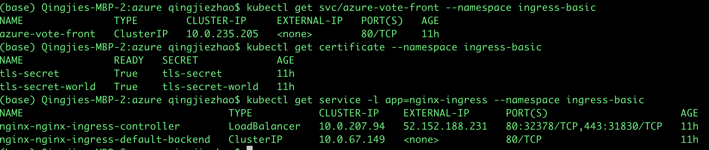
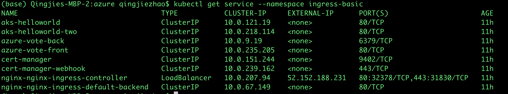
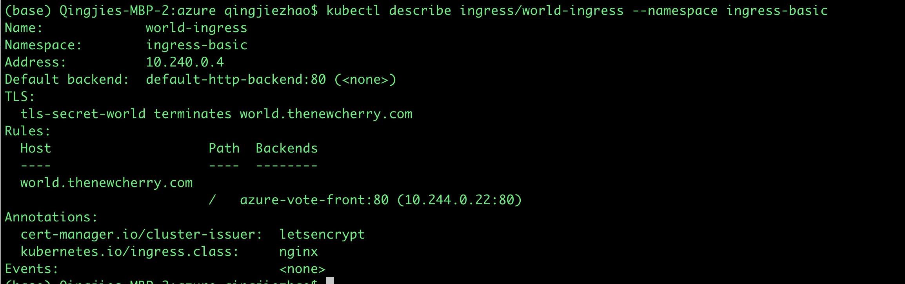
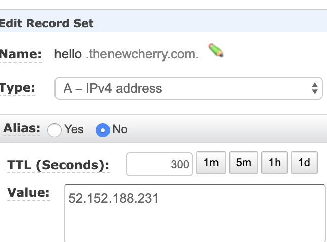
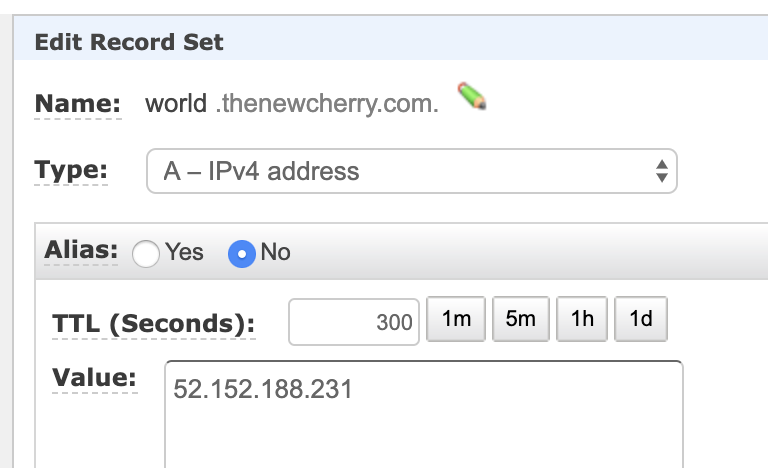
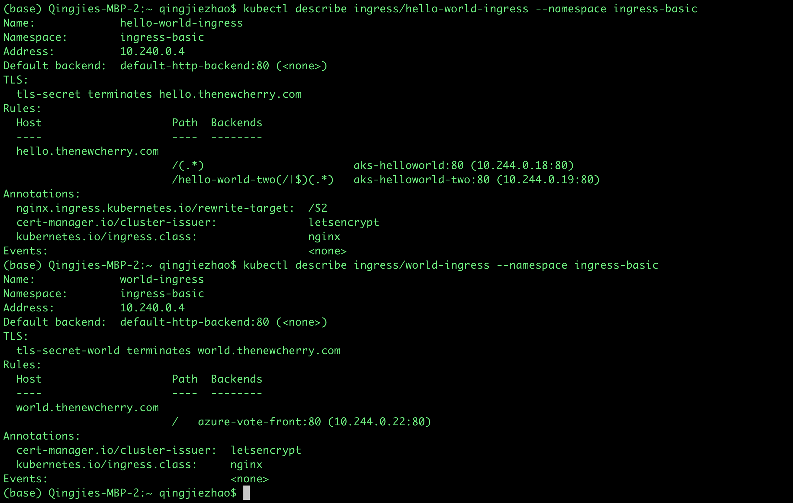
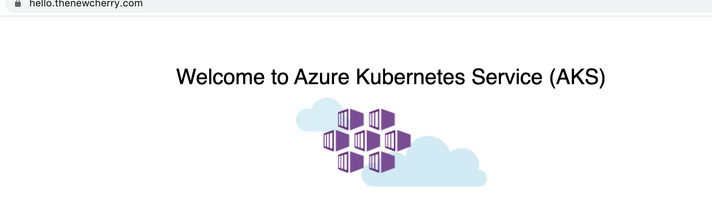
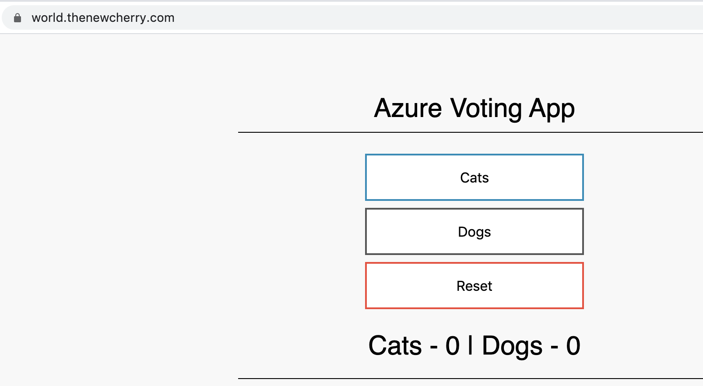

* 1. install nginx-ingress controler, it has external-loadbalacer
* 2. install certi-manager
* 3. set in rout53
* 4. create cluster issuer
* 5. create certificate or ingress

https://docs.microsoft.com/en-us/azure/aks/ingress-tls

```
------
# Create a namespace for your ingress resources
kubectl create namespace ingress-basic

# Add the official stable repo
helm repo add stable https://kubernetes-charts.storage.googleapis.com/

# Use Helm to deploy an NGINX ingress controller
helm install --name nginx stable/nginx-ingress \
    --namespace ingress-basic \
    --set controller.replicaCount=2 \
    --set controller.nodeSelector."beta\.kubernetes\.io/os"=linux \
    --set defaultBackend.nodeSelector."beta\.kubernetes\.io/os"=linux


kubectl get service -l app=nginx-ingress --namespace ingress-basic


##### change53


# Install the CustomResourceDefinition resources separately
kubectl apply --validate=false -f https://raw.githubusercontent.com/jetstack/cert-manager/release-0.12/deploy/manifests/00-crds.yaml --namespace ingress-basic

# Label the ingress-basic namespace to disable resource validation
kubectl label namespace ingress-basic certmanager.k8s.io/disable-validation=true

# Add the Jetstack Helm repository
helm repo add jetstack https://charts.jetstack.io

# Update your local Helm chart repository cache
helm repo update

# Install the cert-manager Helm chart
helm install cert-manager --namespace ingress-basic --version v0.12.0 jetstack/cert-manager --set ingressShim.defaultIssuerName=letsencrypt --set ingressShim.defaultIssuerKind=ClusterIssuer


apiVersion: cert-manager.io/v1alpha2
kind: ClusterIssuer
metadata:
  name: letsencrypt
spec:
  acme:
    server: https://acme-v02.api.letsencrypt.org/directory
    email: zhaoqingjie@gmail.com
    privateKeySecretRef:
      name: letsencrypt
    solvers:
    - http01:
        ingress:
          class: nginx


helm repo add azure-samples https://azure-samples.github.io/helm-charts/

helm install aks-helloworld azure-samples/aks-helloworld --namespace ingress-basic

helm install --name aks-helloworld-two azure-samples/aks-helloworld \
    --namespace ingress-basic \
    --set title="AKS Ingress Demo" \
    --set serviceName="aks-helloworld-two"


apiVersion: extensions/v1beta1
kind: Ingress
metadata:
  name: hello-world-ingress
  annotations:
    kubernetes.io/ingress.class: nginx
    nginx.ingress.kubernetes.io/rewrite-target: /$2
    cert-manager.io/cluster-issuer: letsencrypt
spec:
  tls:
  - hosts:
    - hello.thenewcherry.com
    secretName: tls-secret
  rules:
  - host: hello.thenewcherry.com
    http:
      paths:
      - backend:
          serviceName: aks-helloworld
          servicePort: 80
        path: /(.*)
      - backend:
          serviceName: aks-helloworld-two
          servicePort: 80
        path: /hello-world-two(/|$)(.*)
---
apiVersion: extensions/v1beta1
kind: Ingress
metadata:
  name: hello-world-ingress-static
  annotations:
    kubernetes.io/ingress.class: nginx
    nginx.ingress.kubernetes.io/rewrite-target: /static/$2
    cert-manager.io/cluster-issuer: letsencrypt
spec:
  tls:
  - hosts:
    - hello.thenewcherry.com
    secretName: tls-secret
  rules:
  - host: hello.thenewcherry.com
    http:
      paths:
      - backend:
          serviceName: aks-helloworld
          servicePort: 80
        path: /static(/|$)(.*)
```

```
apiVersion: apps/v1
kind: Deployment
metadata:
  name: azure-vote-back
  namespace: ingress-basic
spec:
  replicas: 1
  selector:
    matchLabels:
      app: azure-vote-back
  template:
    metadata:
      labels:
        app: azure-vote-back
    spec:
      nodeSelector:
        "beta.kubernetes.io/os": linux
      containers:
      - name: azure-vote-back
        image: redis
        resources:
          requests:
            cpu: 100m
            memory: 128Mi
          limits:
            cpu: 250m
            memory: 256Mi
        ports:
        - containerPort: 6379
          name: redis
---
apiVersion: v1
kind: Service
metadata:
  name: azure-vote-back
  namespace: ingress-basic
spec:
  ports:
  - port: 6379
  selector:
    app: azure-vote-back
---
apiVersion: apps/v1
kind: Deployment
metadata:
  name: azure-vote-front
  namespace: ingress-basic
spec:
  replicas: 1
  selector:
    matchLabels:
      app: azure-vote-front
  template:
    metadata:
      labels:
        app: azure-vote-front
    spec:
      nodeSelector:
        "beta.kubernetes.io/os": linux
      containers:
      - name: azure-vote-front
        image: microsoft/azure-vote-front:v1
        resources:
          requests:
            cpu: 100m
            memory: 128Mi
          limits:
            cpu: 250m
            memory: 256Mi
        ports:
        - containerPort: 80
        env:
        - name: REDIS
          value: "azure-vote-back"
---
apiVersion: v1
kind: Service
metadata:
  name: azure-vote-front
  namespace: ingress-basic
spec:
  type: LoadBalancer
  ports:
  - port: 80
  selector:
    app: azure-vote-front
```

* kubectl port-forward svc/azure-vote-front 8080:80

```

 
  664  helm install --name nginx stable/nginx-ingress     --namespace ingress-basic     --set controller.replicaCount=2     --set controller.nodeSelector."beta\.kubernetes\.io/os"=linux     --set defaultBackend.nodeSelector."beta\.kubernetes\.io/os"=linux
  665  kubectl create serviceaccount --namespace kube-system tiller
  666  kubectl create clusterrolebinding tiller-cluster-rule --clusterrole=cluster-admin --serviceaccount=kube-system:tiller
  667  kubectl patch deploy --namespace kube-system tiller-deploy -p '{"spec":{"template":{"spec":{"serviceAccount":"tiller"}}}}'
  669  helm install --name nginx stable/nginx-ingress     --namespace ingress-basic     --set controller.replicaCount=2     --set controller.nodeSelector."beta\.kubernetes\.io/os"=linux     --set defaultBackend.nodeSelector."beta\.kubernetes\.io/os"=linux
  670  kubectl get service -l app=nginx-ingress --namespace ingress-basic
  671  dig 
  673  dig hello.thenewcherry.com
  674  kubectl apply --validate=false -f https://raw.githubusercontent.com/jetstack/cert-manager/release-0.12/deploy/manifests/00-crds.yaml --namespace ingress-basic
  675  kubectl label namespace ingress-basic certmanager.k8s.io/disable-validation=true
  676  helm repo add jetstack https://charts.jetstack.io
  677  helm repo update
  679  helm install --name cert-manager --namespace ingress-basic --version v0.12.0 jetstack/cert-manager --set ingressShim.defaultIssuerName=letsencrypt --set ingressShim.defaultIssuerKind=ClusterIssuer
  680  kubectl get crd
  685  vi ClusterIssuer.yaml
  686  kubectl create -f ClusterIssuer.yaml --namespace ingress-basic
  687  kubectl get pod
  688  kubectl get pods --namespace ingress-basic
  689  kubectl create -f ClusterIssuer.yaml --namespace ingress-basic
  691  helm repo add azure-samples https://azure-samples.github.io/helm-charts/
  693  helm install --name aks-helloworld azure-samples/aks-helloworld --namespace ingress-basic
  695  helm install --name aks-helloworld-two azure-samples/aks-helloworld     --namespace ingress-basic     --set title="AKS Ingress Demo"     --set serviceName="aks-helloworld-two"
  696  vi ingress-hell0.yaml
  698  kubectl create -f ingress-hell0.yaml --namespace ingress-basic
  701  kubectl get certificate
  702  kubectl get certificate --namespace ingress-basic
  703  kubectl get ns
  704  kubectl get pod --namespace ingress-basic
  706  vi ingress-hell0.yaml 
  707  vi azure-vote.yaml 
  708  vi azure-vote1.yaml
  709  vi azure-vote1.yaml
  710  vi azure-vote1.yaml
  711  kubectl create -f azure-vote1.yaml --namespace ingress-basic
  712  kubectl get svc
  713  kubectl get svc --namespace ingress-basic
  716  dig world.thenewcherry.com
  719  cp ingress-hell0.yaml ingress-world.yaml 
  720  vi ingress-world.yaml 
  722  kubectl get svc --namespace ingress-basic
  723  vi ingress-world.yaml 
  724  kubectl create -f ingress-world.yaml --namespace ingress-basic
  725  vi ingress-world.yaml 
  726  kubectl create -f ingress-world.yaml --namespace ingress-basic
  727  kubectl get certificate --namespace ingress-basic
  729  vi ingress-world.yaml 
  731  kubectl edit ingress world-ingress --namespace ingress-basic
  732  kubectl get certificate --namespace ingress-basic
  733  kubectl get certificate --namespace ingress-basic
  735  kubectl port-forward svc/azure-vote-front 8080:80
  736  kubectl port-forward svc/azure-vote-front 8080:80 --namespace ingress-basic
  738  vi ingress-world.yaml 
  739  kubectl edit ingress world-ingress --namespace ingress-basic
  740  kubectl describe ingress/ingress-world
  741  kubectl describe ingress/world-ingress --namespace ingress-basic
  742  kubectl edit ingress world-ingress --namespace ingress-basic
```







check lock

check lock

